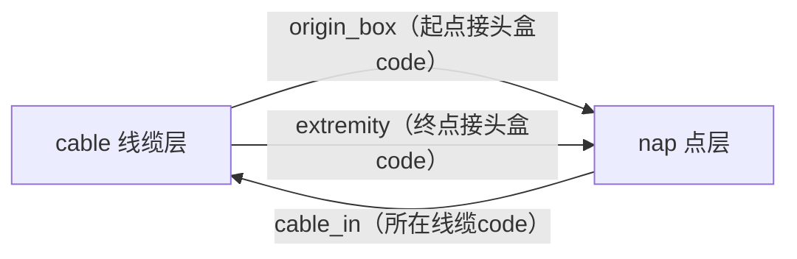

背景，qgis工层中，nap.gpkg点图层和cable.gpkg线图层

cable 线缆图层

| name        | type      | comment                                                      |
| ----------- | --------- | ------------------------------------------------------------ |
| code        | string    | 光纤线缆的code                                               |
| level       | integer32 | 枚举值：1；2；3  分别代表distribution01,02,03，三种等级的光缆<br />1级光缆从SRO点引出，其上的pass点是class=Closure的点，终点不会是class=PBO类型的点<br />2级光缆只能从1级光缆的pass点或者终点引出，，其上的pass点是class=Closure的点，终点不会是class=PBO类型的点<br />3级光缆可以从1/2级光缆的pass点或者终点引出，3级光缆上的pass点和终点是class=PBO类型的点 |
| r_nodes     | string    | 在cable上的一系列点的路由值拼接而成                          |
| type        | string    | 光纤类型                                                     |
| fiber_count | integer32 | 所在cable的pass点序号，从1开始计数，整数，100表示终点        |
| extremity   | integer32 | 在所在的cable线缆上， 使用的纤芯的起始序号                   |
| port_start  | integer32 | 在所在的cable线缆上， 使用的纤芯的终点序号                   |
| port_end    | integer32 | 追溯到最源头的主线缆上，需要跳过的纤芯的绝对数量             |
| origin_box  | string    | 光缆的起点，用nap表中的code字段值表示                        |


nap 光纤接头盒图层表结构

| name       | type      | comment                                               |
| ---------- | --------- | ----------------------------------------------------- |
| code       | string    | 光纤接头盒对象的code                                  |
| class      | string    | 点对象的类型枚举值有：SRO,Closure,PBO,OLT             |
| type       | string    | 点类型                                                |
| cable_in   | string    | cable的code，表示位于哪个cable上，                    |
| pass_seq   | integer32 | 所在cable的pass点序号，从1开始计数，整数，100表示终点 |
| in_start   | integer32 | 在所在的cable线缆上， 使用的纤芯的起始序号            |
| in_end     | integer32 | 在所在的cable线缆上， 使用的纤芯的终点序号            |
| skip_count | integer32 | 追溯到最源头的主线缆上，需要跳过的纤芯的绝对数量      |

请记住这些表结构与表间关系


---

更正下：

你的理解：

```
通过 `pass_seq` 确定接头盒在线缆上的顺序（1 = 起点，100 = 终点）
```

实际：

```
线缆的起点，在nap表中，pass_seq字段是没有值的，即：线缆的起点不是第一个pass点,除了起点，中间点才算pass点，终点（pass_seq=100)是个特殊的pass点
```

---

~~~markdown
我已清晰掌握 `nap.gpkg`（点图层，光纤接头盒）与 `cable.gpkg`（线图层，线缆）的表结构、字段含义及核心关联规则，以下为关键信息的梳理总结，方便后续基于此背景开展操作（如数据验证、关联查询、拓扑检查等）：


### 一、核心图层与字段梳理
#### 1. 线图层：`cable.gpkg`（线缆）
| 核心字段       | 数据类型   | 关键含义与约束                                                                 |
|----------------|------------|------------------------------------------------------------------------------|
| `code`         | string     | 线缆唯一标识（与 `nap` 表的 `cable_in` 关联）                                  |
| `level`        | integer32  | 光缆等级（1/2/3），对应 `distribution01/02/03`，**规则严格约束起点/终点/中间点类型** |
| `r_nodes`      | string     | 线缆上所有 `nap` 点的“路由值”拼接（如按 `pass_seq` 顺序拼接 `nap.code`）          |
| `type`         | string     | 光纤类型，由 `fiber_count` 决定：`type = str(fiber_count) + "FO"`（如24芯→“24FO”） |
| `fiber_count`  | integer32  | 光缆芯数，是 `type` 字段的生成依据                                            |
| `origin_box`   | string     | 线缆**起点**（关联 `nap.code`，即起点接头盒的唯一标识）                        |
| `extremity`    | integer32  | 线缆**终点**（关联 `nap.code`，即终点接头盒的唯一标识）                        |
| `port_start`   | integer32  | 起点接头盒中，该线缆使用的纤芯“起始序号”                                      |
| `port_end`     | integer32  | 起点接头盒中，该线缆使用的纤芯“结束序号”                                      |


#### 2. 点图层：`nap.gpkg`（光纤接头盒）
| 核心字段       | 数据类型   | 关键含义与约束                                                                 |
|----------------|------------|------------------------------------------------------------------------------|
| `code`         | string     | 接头盒唯一标识（与 `cable` 表的 `origin_box`/`extremity` 关联）                |
| `class`        | string     | 接头盒类型（枚举：`SRO`/`Closure`/`PBO`/`OLT`），**决定线缆的连接规则**         |
| `type`         | string     | 点的具体类型（补充 `class` 的细分信息）                                        |
| `cable_in`     | string     | 该接头盒**所在的线缆**（关联 `cable.code`，即该点属于哪条线缆）                |
| `pass_seq`     | integer32  | 在线缆上的“序号”：1=起点，100=终点，1-99=中间pass点（按路由顺序排列）           |
| `in_start`     | integer32  | 该点在线缆上使用的纤芯“起始序号”                                              |
| `in_end`       | integer32  | 该点在线缆上使用的纤芯“结束序号”                                              |
| `skip_count`   | integer32  | 追溯到“源头主线缆”（通常是Level1光缆）时，需跳过的纤芯“绝对数量”                |


### 二、图层间关键关联关系
两个图层通过 **“线缆标识（code）”** 和 **“接头盒标识（code）”** 形成强关联，核心关联逻辑如下：

具体关联字段映射表：

| 关联场景                | cable 表字段       | nap 表对应字段     | 说明                                  |
|-------------------------|--------------------|--------------------|---------------------------------------|
| 线缆起点 → 接头盒       | `origin_box`       | `code`             | 线缆的起点必须是一个存在的接头盒      |
| 线缆终点 → 接头盒       | `extremity`        | `code`             | 线缆的终点必须是一个存在的接头盒      |
| 接头盒 → 所属线缆       | `code`             | `cable_in`         | 每个接头盒必须属于一条存在的线缆      |
| 接头盒在线缆上的位置    | `code`             | `cable_in + pass_seq` | 通过 `pass_seq` 确定接头盒在线缆上的顺序（不含起点，1=第一个pass点，2=第二个pass点，100=终点，属于一个特殊的pass点） |


### 三、光缆等级（`level`）核心规则（关键约束）
`cable.level` 决定了线缆的“连接来源”“中间点类型”“终点类型”，是数据合法性验证的核心，规则如下：

#### 1. Level 1（distribution01，源头光缆）
- **起点约束**：必须从 `nap.class = SRO` 的接头盒引出（即 `cable.origin_box` 对应的 `nap.code` 的 `class` 必须是 `SRO`）
- **中间pass点约束**：线缆上所有中间点（`nap.cable_in = 该线缆code` 且 `pass_seq 1-99`）的 `nap.class` 必须是 `Closure`
- **终点约束**：终点接头盒（`cable.extremity` 对应的 `nap.code`）的 `class` **不能是 `PBO`**


#### 2. Level 2（distribution02，二级光缆）
- **起点约束**：只能从 Level 1 光缆的以下位置引出：
  - Level 1 光缆的中间pass点（`nap.class = Closure` 且 `nap.cable_in = Level1线缆code`）
  - Level 1 光缆的终点（`cable.extremity` 对应的 `nap.code`）
- **中间pass点约束**：同Level1，`nap.class = Closure`
- **终点约束**：同Level1，`nap.class ≠ PBO`


#### 3. Level 3（distribution03，末端光缆）
- **起点约束**：可从 Level 1 或 Level 2 光缆的以下位置引出：
  - Level1/2 光缆的中间pass点（`nap.class = Closure`）
  - Level1/2 光缆的终点
- **中间pass点 + 终点约束**：与Level1/2相反，线缆上所有点（中间pass点+终点）的 `nap.class` **必须是 `PBO`**


### 四、其他关键属性约束
1. **`cable.type` 与 `fiber_count` 一致性**：`type` 必须严格等于 `str(fiber_count) + "FO"`（如 `fiber_count=48` → `type="48FO"`），否则为数据错误。
2. **`nap.pass_seq` 合理性**：
   - 线缆起点对应的 `nap` 点，`pass_seq` 应设为 `1`；
   - 线缆终点对应的 `nap` 点，`pass_seq` 应设为 `100`；
   - 中间点 `pass_seq` 需为 `2-99` 的整数，且按路由顺序递增（如从起点到终点，`pass_seq` 1→5→12→100）。


基于以上梳理的信息，后续可支持的操作场景包括：
- 在QGIS中建立图层关联（如通过“连接属性表”关联 `cable` 和 `nap`）；
- 验证数据合法性（如检查Level3光缆的终点是否为PBO、`type`与`fiber_count`是否匹配）；
- 批量生成/更新字段（如通过`fiber_count`自动计算`type`）；
- 拓扑检查（如线缆起点/终点是否存在对应的`nap`点、`pass_seq`是否连续）等。

若你有具体的操作需求（如上述某类场景的实现步骤），可进一步说明。
~~~


```markdown
感谢你的更正！针对 `nap.pass_seq` 字段的含义，我已根据你的说明更新理解，核心修正点及关联逻辑调整如下：


### 一、`nap.pass_seq` 字段的准确含义
| 点的类型       | `pass_seq` 取值       | 说明                                                                 |
|----------------|-----------------------|----------------------------------------------------------------------|
| 线缆的起点     | 无值（空值/NULL）     | 线缆的起点（对应 `cable.origin_box` 的 `nap.code`）不属于“pass点”，因此 `pass_seq` 为空 |
| 中间pass点     | 1-99 的整数           | 除起点和终点外的中间点，属于“pass点”，`pass_seq` 按路由顺序从1开始递增（1 < 2 < ... < 99） |
| 线缆的终点     | 100                   | 终点是特殊的“pass点”，固定用 `pass_seq=100` 标识（对应 `cable.extremity` 的 `nap.code`） |


### 二、关联规则的修正调整
#### 1. 线缆上的点的路由顺序（`cable.r_nodes` 拼接逻辑）
`cable.r_nodes` 是线缆上所有点的路由值（通常为 `nap.code`）按实际物理顺序的拼接，顺序为：  
**起点（`pass_seq` 空值）→ 中间pass点（`pass_seq` 1→2→...→99）→ 终点（`pass_seq=100`）**  


#### 2. 光缆等级（`level`）规则中“pass点”的范围修正
- **Level 1 光缆**：  
  其“pass点”仅指中间pass点（`pass_seq` 1-99），这些点的 `nap.class` 必须为 `Closure`；  
  起点（`pass_seq` 空值）是 `class=SRO` 的点，终点（`pass_seq=100`）的 `class` 不能是 `PBO`。  

- **Level 2 光缆**：  
  其“pass点”仅指中间pass点（`pass_seq` 1-99），`nap.class` 必须为 `Closure`；  
  起点只能是 Level 1 光缆的 **中间pass点（`pass_seq` 1-99，`class=Closure`）** 或 **终点（`pass_seq=100`）**；  
  终点（`pass_seq=100`）的 `class` 不能是 `PBO`。  

- **Level 3 光缆**：  
  其“pass点”包括中间pass点（`pass_seq` 1-99）和终点（`pass_seq=100`），这些点的 `nap.class` 必须为 `PBO`；  
  起点可以是 Level 1/2 光缆的 **中间pass点（`pass_seq` 1-99）** 或 **终点（`pass_seq=100`）**。  


#### 3. `nap` 与 `cable` 的关联验证补充
- 若一个 `nap` 点是某线缆的起点（即 `cable.origin_box = nap.code`），则该 `nap` 点的 `pass_seq` 必须为空，且 `cable_in` 应关联到该线缆的 `code`（即该点属于这条线缆）。  
- 若一个 `nap` 点是某线缆的终点（即 `cable.extremity = nap.code`），则该 `nap` 点的 `pass_seq` 必须为100，且 `cable_in` 应关联到该线缆的 `code`。  


以上修正已同步覆盖字段含义、路由顺序及等级规则中与 `pass_seq` 相关的逻辑，若还有其他细节需要调整，可随时补充说明。
```


---


[lamboxr/cable-topo-demo2](https://github.com/lamboxr/cable-topo-demo2)

这个仓库就是为解析cable,nap gpkg图层，并生成逻辑topo图而创建的项目

- utils.gda_utils.py的class LayerDGA 用于创建单例的图层数据服务类，用于查询修改单个gpkg文件（只有单一图层）中的单个图层
- data_service包下的data_service_cable.py, data_service_nap.py，用于各自图层的自定义业务函数，用于查询/处理图层数据，可以根据需要进行扩展
- init_data.py用于计算并补全cable, nap图层数据中的基础数据字段，这些数据在生成topo图中需要用到
- gen_topo.py是个空文件，是用于将来实现创建topo图的入口脚本
- PE.md只是用于记录我与你的对话记录的，不要作为首选参考，以我在会话中提出的需求为准

先了代码结构，不要开始实施，了解清楚后，等我提需求逻辑并渐进式编码

```markdown
已了解项目结构及各模块职责：

- **核心数据操作层**：`utils.gda_utils.LayerDGA` 提供单例模式的 GeoPackage 图层读写能力，包含查询、更新、保存等基础操作。
- **业务数据服务层**：`data_service` 下的 `data_service_cable.py` 和 `data_service_nap.py` 封装了线缆和节点图层的自定义业务逻辑（如查询特定线缆、更新属性等）。
- **数据初始化层**：`init_data.py` 负责补全拓扑计算所需的基础字段（如 `skip_count`、`extremity` 等）。
- **拓扑生成入口**：`gen_topo.py` 作为预留入口，将用于实现逻辑拓扑图的生成逻辑。

请您提出具体的拓扑图生成需求逻辑，我会基于现有结构渐进式实现代码。
```


我需要将线缆和点的连接与层级关系一excel表的形式表示逻辑拓扑图

## **逻辑梳理**：

### **topo图基本规则**

1. 列定义：

   - 占用A-G列

   - 盒子对象列：A,C,E,G表示点对象，A列是SRO类型的盒子，C,E表示线缆上的Closure点，G列表示PBO点
   - 线缆对象列：B,D,F表示线缆对象，分别表示level= 1,2,3的线缆

2. 行定义:

   - 每8行为一组，属于当前列为每一个对象分配的独立描绘空间

3. 盒子描绘规则

   - A列-SRO盒子

     - 列宽：12

     - 在8行描绘空间中，从第1行单元格到第4行单元格，总共4个单元格采用粗外侧线框
     - 第1行单元格显示nap.class，加粗，水平居中；
   - 第2行单元格显示nap.code，水平居中
   - C/E/G列盒子

     - 列宽：32
     - 在8行描绘空间中，从第1行单元格到第4行单元格，总共4个单元格采用粗外侧线框
     - 第1行单元格显示nap.class，加粗，水平居中；
     - 第2行单元格值=nap.code + "    " + nap.type ，水平居中；
     - 第4行单元格=nap.in_start + "-" +nap.in_end，水平居中

4. 线缆规则描述

   - B/D/F列线缆
     - 列宽：48
     - 在8行描绘空间中，第1行单元格，下边框加粗线框
     - 第1行单元格显示level，根据1/2/3的值分别对应 Distribution 01/Distribution 02/Distribution 03
     - 第2行单元格=cable.code + "    "+nap.type
     - 第3行单元格=cable.r_nodes
     - 第4行单元格=cable.port_start+"-"+cable.port_end

5. 递归描绘函数主流程

   - 传入点对象，描绘点对象本身
   - 根据点对象查询以它为起点的所有cable对象列表，查询函数 data_service_cable.get_all_cables_start_with_one_point(nap_code)
   - 遍历cable对象列表，循环体中逻辑
     - 描绘当前cable对象
     - 根据data_service_nap.get_all_points_on_cable(cable_code)

   - SRO是根节点，nap图层查找所有class=SRO的点，根据编号code升序排列
   - 遍历SRO点列表，
   - 查找cable图层，根据cable.code=nap.cable_in查询所有cable, 根据cable.code升序排列
   - 