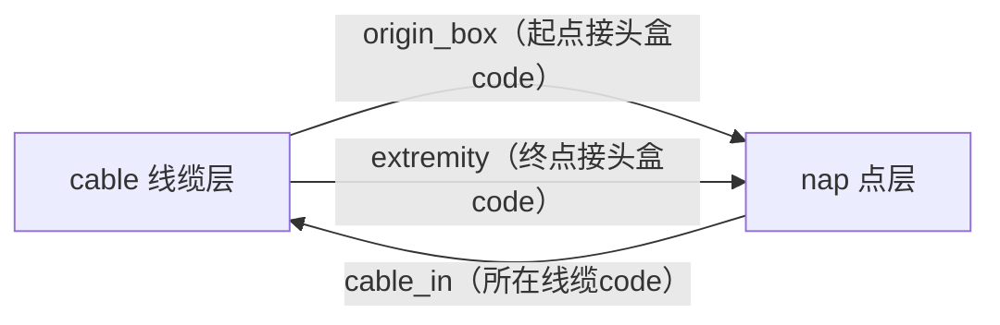

背景，qgis工层中，nap.gpkg点图层和cable.gpkg线图层

cable 线缆图层

| name        | type      | comment                                                      |
| ----------- | --------- | ------------------------------------------------------------ |
| code        | string    | 光纤线缆的code                                               |
| level       | integer32 | 枚举值：1；2；3  分别代表distribution01,02,03，三种等级的光缆<br />1级光缆从SRO点引出，其上的pass点是class=Closure的点，终点不会是class=PBO类型的点<br />2级光缆只能从1级光缆的pass点或者终点引出，，其上的pass点是class=Closure的点，终点不会是class=PBO类型的点<br />3级光缆可以从1/2级光缆的pass点或者终点引出，3级光缆上的pass点和终点是class=PBO类型的点 |
| r_nodes     | string    | 在cable上的一系列点的路由值拼接而成                          |
| type        | string    | 光纤类型                                                     |
| fiber_count | integer32 | 所在cable的pass点序号，从1开始计数，整数，100表示终点        |
| extremity   | integer32 | 在所在的cable线缆上， 使用的纤芯的起始序号                   |
| port_start  | integer32 | 在所在的cable线缆上， 使用的纤芯的终点序号                   |
| port_end    | integer32 | 追溯到最源头的主线缆上，需要跳过的纤芯的绝对数量             |
| origin_box  | string    | 光缆的起点，用nap表中的code字段值表示                        |


nap 光纤接头盒图层表结构

| name       | type      | comment                                               |
| ---------- | --------- | ----------------------------------------------------- |
| code       | string    | 光纤接头盒对象的code                                  |
| class      | string    | 点对象的类型枚举值有：SRO,Closure,PBO,OLT             |
| type       | string    | 点类型                                                |
| cable_in   | string    | cable的code，表示位于哪个cable上，                    |
| pass_seq   | integer32 | 所在cable的pass点序号，从1开始计数，整数，100表示终点 |
| in_start   | integer32 | 在所在的cable线缆上， 使用的纤芯的起始序号            |
| in_end     | integer32 | 在所在的cable线缆上， 使用的纤芯的终点序号            |
| skip_count | integer32 | 追溯到最源头的主线缆上，需要跳过的纤芯的绝对数量      |

请记住这些表结构与表间关系


---

更正下：

你的理解：

```
通过 `pass_seq` 确定接头盒在线缆上的顺序（1 = 起点，100 = 终点）
```

实际：

```
线缆的起点，在nap表中，pass_seq字段是没有值的，即：线缆的起点不是第一个pass点,除了起点，中间点才算pass点，终点（pass_seq=100)是个特殊的pass点
```

---

~~~markdown
我已清晰掌握 `nap.gpkg`（点图层，光纤接头盒）与 `cable.gpkg`（线图层，线缆）的表结构、字段含义及核心关联规则，以下为关键信息的梳理总结，方便后续基于此背景开展操作（如数据验证、关联查询、拓扑检查等）：


### 一、核心图层与字段梳理
#### 1. 线图层：`cable.gpkg`（线缆）
| 核心字段       | 数据类型   | 关键含义与约束                                                                 |
|----------------|------------|------------------------------------------------------------------------------|
| `code`         | string     | 线缆唯一标识（与 `nap` 表的 `cable_in` 关联）                                  |
| `level`        | integer32  | 光缆等级（1/2/3），对应 `distribution01/02/03`，**规则严格约束起点/终点/中间点类型** |
| `r_nodes`      | string     | 线缆上所有 `nap` 点的“路由值”拼接（如按 `pass_seq` 顺序拼接 `nap.code`）          |
| `type`         | string     | 光纤类型，由 `fiber_count` 决定：`type = str(fiber_count) + "FO"`（如24芯→“24FO”） |
| `fiber_count`  | integer32  | 光缆芯数，是 `type` 字段的生成依据                                            |
| `origin_box`   | string     | 线缆**起点**（关联 `nap.code`，即起点接头盒的唯一标识）                        |
| `extremity`    | integer32  | 线缆**终点**（关联 `nap.code`，即终点接头盒的唯一标识）                        |
| `port_start`   | integer32  | 起点接头盒中，该线缆使用的纤芯“起始序号”                                      |
| `port_end`     | integer32  | 起点接头盒中，该线缆使用的纤芯“结束序号”                                      |


#### 2. 点图层：`nap.gpkg`（光纤接头盒）
| 核心字段       | 数据类型   | 关键含义与约束                                                                 |
|----------------|------------|------------------------------------------------------------------------------|
| `code`         | string     | 接头盒唯一标识（与 `cable` 表的 `origin_box`/`extremity` 关联）                |
| `class`        | string     | 接头盒类型（枚举：`SRO`/`Closure`/`PBO`/`OLT`），**决定线缆的连接规则**         |
| `type`         | string     | 点的具体类型（补充 `class` 的细分信息）                                        |
| `cable_in`     | string     | 该接头盒**所在的线缆**（关联 `cable.code`，即该点属于哪条线缆）                |
| `pass_seq`     | integer32  | 在线缆上的“序号”：1=起点，100=终点，1-99=中间pass点（按路由顺序排列）           |
| `in_start`     | integer32  | 该点在线缆上使用的纤芯“起始序号”                                              |
| `in_end`       | integer32  | 该点在线缆上使用的纤芯“结束序号”                                              |
| `skip_count`   | integer32  | 追溯到“源头主线缆”（通常是Level1光缆）时，需跳过的纤芯“绝对数量”                |


### 二、图层间关键关联关系
两个图层通过 **“线缆标识（code）”** 和 **“接头盒标识（code）”** 形成强关联，核心关联逻辑如下：

具体关联字段映射表：

| 关联场景                | cable 表字段       | nap 表对应字段     | 说明                                  |
|-------------------------|--------------------|--------------------|---------------------------------------|
| 线缆起点 → 接头盒       | `origin_box`       | `code`             | 线缆的起点必须是一个存在的接头盒      |
| 线缆终点 → 接头盒       | `extremity`        | `code`             | 线缆的终点必须是一个存在的接头盒      |
| 接头盒 → 所属线缆       | `code`             | `cable_in`         | 每个接头盒必须属于一条存在的线缆      |
| 接头盒在线缆上的位置    | `code`             | `cable_in + pass_seq` | 通过 `pass_seq` 确定接头盒在线缆上的顺序（不含起点，1=第一个pass点，2=第二个pass点，100=终点，属于一个特殊的pass点） |


### 三、光缆等级（`level`）核心规则（关键约束）
`cable.level` 决定了线缆的“连接来源”“中间点类型”“终点类型”，是数据合法性验证的核心，规则如下：

#### 1. Level 1（distribution01，源头光缆）
- **起点约束**：必须从 `nap.class = SRO` 的接头盒引出（即 `cable.origin_box` 对应的 `nap.code` 的 `class` 必须是 `SRO`）
- **中间pass点约束**：线缆上所有中间点（`nap.cable_in = 该线缆code` 且 `pass_seq 1-99`）的 `nap.class` 必须是 `Closure`
- **终点约束**：终点接头盒（`cable.extremity` 对应的 `nap.code`）的 `class` **不能是 `PBO`**


#### 2. Level 2（distribution02，二级光缆）
- **起点约束**：只能从 Level 1 光缆的以下位置引出：
  - Level 1 光缆的中间pass点（`nap.class = Closure` 且 `nap.cable_in = Level1线缆code`）
  - Level 1 光缆的终点（`cable.extremity` 对应的 `nap.code`）
- **中间pass点约束**：同Level1，`nap.class = Closure`
- **终点约束**：同Level1，`nap.class ≠ PBO`


#### 3. Level 3（distribution03，末端光缆）
- **起点约束**：可从 Level 1 或 Level 2 光缆的以下位置引出：
  - Level1/2 光缆的中间pass点（`nap.class = Closure`）
  - Level1/2 光缆的终点
- **中间pass点 + 终点约束**：与Level1/2相反，线缆上所有点（中间pass点+终点）的 `nap.class` **必须是 `PBO`**


### 四、其他关键属性约束
1. **`cable.type` 与 `fiber_count` 一致性**：`type` 必须严格等于 `str(fiber_count) + "FO"`（如 `fiber_count=48` → `type="48FO"`），否则为数据错误。
2. **`nap.pass_seq` 合理性**：
   - 线缆起点对应的 `nap` 点，`pass_seq` 应设为 `1`；
   - 线缆终点对应的 `nap` 点，`pass_seq` 应设为 `100`；
   - 中间点 `pass_seq` 需为 `2-99` 的整数，且按路由顺序递增（如从起点到终点，`pass_seq` 1→5→12→100）。


基于以上梳理的信息，后续可支持的操作场景包括：
- 在QGIS中建立图层关联（如通过“连接属性表”关联 `cable` 和 `nap`）；
- 验证数据合法性（如检查Level3光缆的终点是否为PBO、`type`与`fiber_count`是否匹配）；
- 批量生成/更新字段（如通过`fiber_count`自动计算`type`）；
- 拓扑检查（如线缆起点/终点是否存在对应的`nap`点、`pass_seq`是否连续）等。

若你有具体的操作需求（如上述某类场景的实现步骤），可进一步说明。
~~~


```markdown
感谢你的更正！针对 `nap.pass_seq` 字段的含义，我已根据你的说明更新理解，核心修正点及关联逻辑调整如下：


### 一、`nap.pass_seq` 字段的准确含义
| 点的类型       | `pass_seq` 取值       | 说明                                                                 |
|----------------|-----------------------|----------------------------------------------------------------------|
| 线缆的起点     | 无值（空值/NULL）     | 线缆的起点（对应 `cable.origin_box` 的 `nap.code`）不属于“pass点”，因此 `pass_seq` 为空 |
| 中间pass点     | 1-99 的整数           | 除起点和终点外的中间点，属于“pass点”，`pass_seq` 按路由顺序从1开始递增（1 < 2 < ... < 99） |
| 线缆的终点     | 100                   | 终点是特殊的“pass点”，固定用 `pass_seq=100` 标识（对应 `cable.extremity` 的 `nap.code`） |


### 二、关联规则的修正调整
#### 1. 线缆上的点的路由顺序（`cable.r_nodes` 拼接逻辑）
`cable.r_nodes` 是线缆上所有点的路由值（通常为 `nap.code`）按实际物理顺序的拼接，顺序为：  
**起点（`pass_seq` 空值）→ 中间pass点（`pass_seq` 1→2→...→99）→ 终点（`pass_seq=100`）**  


#### 2. 光缆等级（`level`）规则中“pass点”的范围修正
- **Level 1 光缆**：  
  其“pass点”仅指中间pass点（`pass_seq` 1-99），这些点的 `nap.class` 必须为 `Closure`；  
  起点（`pass_seq` 空值）是 `class=SRO` 的点，终点（`pass_seq=100`）的 `class` 不能是 `PBO`。  

- **Level 2 光缆**：  
  其“pass点”仅指中间pass点（`pass_seq` 1-99），`nap.class` 必须为 `Closure`；  
  起点只能是 Level 1 光缆的 **中间pass点（`pass_seq` 1-99，`class=Closure`）** 或 **终点（`pass_seq=100`）**；  
  终点（`pass_seq=100`）的 `class` 不能是 `PBO`。  

- **Level 3 光缆**：  
  其“pass点”包括中间pass点（`pass_seq` 1-99）和终点（`pass_seq=100`），这些点的 `nap.class` 必须为 `PBO`；  
  起点可以是 Level 1/2 光缆的 **中间pass点（`pass_seq` 1-99）** 或 **终点（`pass_seq=100`）**。  


#### 3. `nap` 与 `cable` 的关联验证补充
- 若一个 `nap` 点是某线缆的起点（即 `cable.origin_box = nap.code`），则该 `nap` 点的 `pass_seq` 必须为空，且 `cable_in` 应关联到该线缆的 `code`（即该点属于这条线缆）。  
- 若一个 `nap` 点是某线缆的终点（即 `cable.extremity = nap.code`），则该 `nap` 点的 `pass_seq` 必须为100，且 `cable_in` 应关联到该线缆的 `code`。  


以上修正已同步覆盖字段含义、路由顺序及等级规则中与 `pass_seq` 相关的逻辑，若还有其他细节需要调整，可随时补充说明。
```


---


[lamboxr/cable-topo-demo2](https://github.com/lamboxr/cable-topo-demo2)

这个仓库就是为解析cable,nap gpkg图层，并生成逻辑topo图而创建的项目

- utils.gda_utils.py的class LayerDGA 用于创建单例的图层数据服务类，用于查询修改单个gpkg文件（只有单一图层）中的单个图层
- data_service包下的data_service_cable.py, data_service_nap.py，用于各自图层的自定义业务函数，用于查询/处理图层数据，可以根据需要进行扩展
- init_data.py用于计算并补全cable, nap图层数据中的基础数据字段，这些数据在生成topo图中需要用到
- gen_topo.py是个空文件，是用于将来实现创建topo图的入口脚本
- PE.md只是用于记录我与你的对话记录的，不要作为首选参考，以我在会话中提出的需求为准

先了代码结构，不要开始实施，了解清楚后，等我提需求逻辑并渐进式编码

```markdown
已了解项目结构及各模块职责：

- **核心数据操作层**：`utils.gda_utils.LayerDGA` 提供单例模式的 GeoPackage 图层读写能力，包含查询、更新、保存等基础操作。
- **业务数据服务层**：`data_service` 下的 `data_service_cable.py` 和 `data_service_nap.py` 封装了线缆和节点图层的自定义业务逻辑（如查询特定线缆、更新属性等）。
- **数据初始化层**：`init_data.py` 负责补全拓扑计算所需的基础字段（如 `skip_count`、`extremity` 等）。
- **拓扑生成入口**：`gen_topo.py` 作为预留入口，将用于实现逻辑拓扑图的生成逻辑。

请您提出具体的拓扑图生成需求逻辑，我会基于现有结构渐进式实现代码。
```

---

我提交了新的代码，新增了排序查询的基础函数，请只读分析工程文件

```markdown
从提供的工程文件来看，新增的排序查询基础函数主要集中在数据服务层（`data_service`）和核心数据操作层（`utils.gda_utils.LayerDGA`），主要功能是支持按指定字段对查询结果进行排序，具体分析如下：


### 1. 核心数据操作层：`LayerDGA` 类的排序查询支持
`utils.gda_utils.LayerDGA` 中的 `get_features_by_condition` 方法被扩展为支持多字段排序，关键更新点：
- 新增 `sort_by` 参数（列表类型）：支持传入多个字段名（如 `["type", "code"]`），指定排序依据。
- 新增 `ascending` 参数（布尔值或列表）：控制排序方向，可对每个字段单独指定升序/降序（如 `[True, False]` 表示第一个字段升序、第二个字段降序）。
- 内部逻辑：先通过条件筛选要素，再根据 `sort_by` 和 `ascending` 对结果进行排序，确保返回有序的 `GeoDataFrame`。


### 2. 业务数据服务层：线缆图层（`data_service_cable.py`）的排序查询函数
新增了基于起点查询线缆并支持排序的函数：
- `get_all_cables_start_with_one_point_by_orders`：  
  接收 `nap_code`（起点编号）、`sort_by`（排序字段列表）、`ascending`（排序方向），调用 `LayerDGA.get_features_by_condition` 实现按条件+排序查询。
- 衍生函数 `get_all_cables_start_with_one_point_order_by_code_asc`：  
  封装了按 `code` 字段升序的查询（固定 `sort_by=["code"], ascending=True`），简化常用排序场景。


### 3. 业务数据服务层：节点图层（`data_service_nap.py`）的排序查询函数
新增了针对节点的排序查询函数，覆盖两类场景：
- SRO 节点排序查询：  
  `get_all_sro_points_by_orders` 支持按指定字段排序查询所有 `class="SRO"` 的节点；衍生函数 `get_all_sro_points_by_order_code_asc` 固定按 `code` 升序。
- 线缆上的节点排序查询：  
  `get_all_points_on_cable_by_orders` 支持按指定字段排序查询某线缆（`cable_code`）上的所有节点；衍生函数 `get_all_points_on_cable_by_order_in_start_asc` 固定按 `in_start` 字段升序。


### 4. 测试层：`test.py` 中的排序查询验证
新增 `test_sorted_query` 函数，通过调用上述排序查询函数（如 `get_all_cables_start_with_one_point_by_orders` 和 `get_all_points_on_cable_by_order_in_start_asc`），验证排序逻辑的正确性，输出结果用于确认排序效果。


### 总结
新增的排序查询函数通过 **“核心层支持多字段排序 + 业务层封装具体场景”** 的方式，实现了对线缆和节点数据的灵活排序查询。这为后续生成逻辑拓扑图（`gen_topo.py`）时按特定顺序（如编号、层级）处理要素提供了基础能力，确保拓扑关系的有序性和一致性。
```


我需要将线缆和点的连接与层级关系一excel表的形式表示逻辑拓扑图

## **逻辑梳理**：

### **topo图基本规则**

1. 列定义：

   - 占用A-G列

   - 盒子对象列：A,C,E,G表示点对象，A列是SRO类型的盒子，C,E表示线缆上的Closure点，G列表示PBO点
   - 线缆对象列：B,D,F表示线缆对象，分别表示level= 1,2,3的线缆
2. 行定义:

   - 每8行为一组，属于当前列为每一个对象分配的独立描绘空间
3. 盒子描绘规则

   - A列-SRO盒子

     - 列宽：12

     - 在8行描绘空间中，从第1行单元格到第4行单元格，总共4个单元格采用粗外侧线框
     - 第1行单元格显示nap.class，加粗，水平居中；
   - 第2行单元格显示nap.code，水平居中
   - C/E/G列盒子

     - 列宽：32
     - 在8行描绘空间中，从第1行单元格到第4行单元格，总共4个单元格采用粗外侧线框
     - 第1行单元格显示nap.class，加粗，水平居中；
     - 第2行单元格=nap.code + "    " + nap.type ，水平居中；
     - 第3行单元格根据nap.pass_seq翻译，如果是小于100的整数，显示"pass" + "%02d" % int(nap.pass_seq),如果是100，显示Exitremity, 水平居中
     - 第4行单元格=nap.in_start + "-" +nap.in_end，水平居中
4. 线缆规则描述

   - B/D/F列线缆
     - 列宽：48
     - 在8行描绘空间中，第2行单元格，下边框加粗线框
     - 第1行单元格显示level，根据1/2/3的值分别对应 Distribution 01/Distribution 02/Distribution 03
     - 第2行单元格=cable.code + "    "+nap.type
     - 第3行单元格=cable.r_nodes
     - 第4行单元格=cable.port_start+"-"+cable.port_end

## 拓扑结构设计

设计一个递归描绘函数** def recursive_rendering(点对象，其他必要参数)**

1. **递归函数主流程**

   - 传入点对象

   - 描绘点对象的拓扑点，使用单独的函数处理，设计必要的入参

   - 根据点对象查询以它为起点的所有cable对象列表，以code排序，查询函数 data_service_cable.get_all_cables_start_with_one_point_order_by_code_asc(nap_code)

   - 遍历cable对象列表，循环体中逻辑如下：

     - 描绘当前cable对象，使用单独的函数处理，设计必要的入参

     - 根据cable.code作为参数，查询在他上面的所有pass点（不含起点），以in_start字段排序，查询函数 data_service_nap.get_all_points_on_cable_by_order_in_start_asc(cable_code)
     - 继续遍历这些pass点，循环体中逻辑如下：
       - 将pass点对象传入到递归函数中进行处理，直到找到出口返回

2. **递归终止条件**

   就是依次无法找到子节点，自动返回上一层递归，继续遍历，直到顶层的遍历结束，无需认为设置特殊的终止信号

3. **递归主流程设计所遵循的原则**

   - 递归主流程，是为了保证，从一个起点开始，一直往下找一条完整的链路，进行描绘，一直描绘到叶子节点，然后返回叶子节点的紧前节点的同级下一个节点，在该同级的下一个节点上，继续寻找子节点，只到找到叶子节点后返回。
   - 因此描绘的顺序并不是先完成所有上级节点，再完成所有次级节点

4. **描绘空间的行号确定最高规则**：每描绘一个对象，不论是点对象，还是线对象，都需要记录下当前的描绘空间行号，赋值给单例全局变量，用于下方的对象描绘空间时进行行号定位。横向在右侧列描绘第一个子对象时，不受该规则限制，直接使用父节点的同行号开辟描绘空间

5. **描绘点对象下的子线缆原则**：
   - 当某一列的点对象找到了其下级所有线缆子对象，在右侧列进行描绘，每个线缆对象占用8个描绘行空间，第一个子线缆的描绘空间与该点对象的描绘空间同行号，剩下的每个线缆依次往下开辟描绘空间，行号确定遵守**描绘空间的行号确定最高规则**
   - 当子线缆对象大于等于2个时，该列中，这一组线缆对象所处的部分连续单元格需要左边框粗线显示。起始单元格：第一个线缆对象描绘空间的第3个单元格，终止单元格：最后一个线缆描绘空间的第2个单元格。
   - 如果C列的点对象的子线缆对象level=2，线缆对象描绘在D列
   - 如果C列的点对象的子线缆对象level=3,   线缆对象描绘在F列，D列的描绘空间不填充文字，但是描绘空间的第2行单元格也要下边框加粗线框，保证视觉上的线条不间断

6. **描绘线缆对象上的pass点和终点（特殊pass点）的原则**：
   - 当一个线缆上查询到了pass点列表，列表中只有一个点对象，且pass_seq=100（即线缆的终点点对象），直接在线缆描绘空间的右侧列同行号开辟描绘空间
   - 当一个线缆上查询到了pass点列表，列表中有大于等于2个对象
     - 在线缆描绘空间的右侧列往下数8行（一个完整的描绘空间）后，开辟描绘空间，多个点对象依次向下开辟描绘空间，行号确定遵守**描绘空间的行号确定最高规则**
     - 该列中，这一组pass点对象所处的部分连续单元格需要左边框粗线显示。起始单元格：第一个点对象描绘空间上方空出的那个描绘空间的第3个单元格，终止单元格：最后一个点对象描绘空间的第2个单元格。


## 主程序流程

- 执行init_data.main初始化基础数据

- SRO是根节点，查询到所有SRO节点，以code排序，查询函数data_service_nap.get_all_sro_points_by_order_code_asc()

- 遍历SRO点列表，循环体中逻辑如下

  - 调用递归函数recursive_rendering(SRO点对象，其他必要参数)

  

## 要求

只读操作，理解并分析需求与设计，检查逻辑合理性，完整性，以及是否有矛盾的地方

  

  

```markdown
从需求设计来看，整体逻辑框架完整，拓扑描绘规则、递归流程与主程序流程的关联性较强，但存在部分需要明确或细化的细节，以下从**合理性、完整性、潜在矛盾**三方面分析：


### **一、逻辑合理性**
1. **层级与列的映射关系**  
   列定义（A-G）与点类型（SRO/Closure/PBO）、线缆等级（level 1-3）的绑定逻辑清晰：  
   - 点列（A/C/E/G）按类型递进（SRO→Closure→Closure→PBO），符合Level 1-3线缆的中间点/终点类型约束（Level 1/2中间点为Closure，Level 3为PBO）；  
   - 线缆列（B/D/F）严格对应level 1-3，与“Level 1从SRO引出，Level 2从Level 1衍生，Level 3从Level 1/2衍生”的规则一致，映射关系合理。

2. **递归流程与拓扑遍历逻辑**  
   采用深度优先遍历（先完整链路再同级节点）符合拓扑结构的“链路完整性优先”原则，与线缆-点的层级依赖关系（如Level 2依赖Level 1）匹配。递归中通过排序函数（`get_all_cables_start_with_one_point_order_by_code_asc`、`get_all_points_on_cable_by_order_in_start_asc`）保证遍历顺序稳定，避免混乱。

3. **描绘空间的行号管理**  
   单例全局变量记录行号+横向子对象同行号的规则，既保证了父子对象的空间关联性（同行号体现连接），又通过“依次往下开辟空间”避免了对象重叠，逻辑自洽。


### **二、完整性分析（需补充的细节）**
1. **递归终止条件未明确**  
   需求提到“直到找到出口返回”，但未定义“出口”的具体判定标准。结合业务逻辑，合理的终止条件应为：  
   - 点对象无下属线缆（`get_all_cables_start_with_one_point_order_by_code_asc`返回空）；  
   - 点对象为Level 3线缆的终点（`nap.class=PBO`且无下属线缆，因Level 3为末端光缆）。  
   需补充该条件以避免无限递归。

2. **D列空值场景的细节缺失**  
   当C列点的子线缆为Level 3时，D列（Level 2对应列）需“不填充文字但第2行下边框加粗”。但未明确：  
   - D列的8行空间是否需要完整保留（避免后续行号计算偏差）；  
   - 边框加粗的具体范围（仅第2行下边框，还是需与上下对象保持视觉连续）。

3. **多对象边框范围的精确性**  
   子线缆≥2时，“左边框从第一个线缆第3个单元格到最后一个线缆第2个单元格”，需明确“第3个单元格”“第2个单元格”对应的行索引（如8行一组中，第3行、第2行），否则可能出现边框错位。

4. **叶子节点的描绘规则**  
   当点对象为叶子节点（无下属线缆）时，其所在列的8行空间是否需要特殊处理（如无右侧连接线），需求未提及，可能导致视觉上的冗余。


### **三、潜在矛盾点（无明显矛盾，但需注意约束）**
1. **线缆等级与列的严格绑定**  
   需求规定“C列点的子线缆level=2→D列，level=3→F列”，需确保数据中不存在“C列点引出Level 1线缆”的情况（违反Level 1起点必须是SRO的约束）。若数据存在异常，需在递归前增加校验（如通过`init_data`确保等级规则），否则会导致列映射错误。

2. **pass点列表的包含范围**  
   需求提到“查询线缆上的所有pass点（不含起点）”，而`get_all_points_on_cable_by_order_in_start_asc`返回的是`cable_in=cable_code`的点，需确保这些点的`pass_seq`为1-99（中间点）或100（终点），且不包含`pass_seq`为空的起点（与`nap`表规则一致），否则会导致递归处理错误的点对象。

3. **全局行号的并发安全性**  
   单例全局变量管理行号在深度优先递归中可行（无并行处理），但需确保递归返回时行号正确回溯（如处理完一个子链路后，行号应累加到该链路的最后一行，再处理同级下一个对象），否则会导致行号计算混乱。


### **总结**
整体设计逻辑自洽，层级映射、递归流程与描绘规则的核心框架完整，无根本性矛盾。需补充的关键细节包括：  
1. 递归终止条件的明确定义；  
2. D列空值场景的空间保留与边框细节；  
3. 多对象边框的行索引精确性；  
4. 叶子节点的特殊描绘规则。  

这些细节补充后，可确保拓扑图的生成逻辑更严谨，符合预期的视觉与层级表达。
```

我添加了一个“递归终止条件”的说明，以下是最新的需求说明

```markdown
我需要将线缆和点的连接与层级关系一excel表的形式表示逻辑拓扑图

## **逻辑梳理**：

### **topo图基本规则**

1. **列定义**：
   - 占用A-G列

   - 盒子对象列：A,C,E,G表示点对象，A列是SRO类型的盒子，C,E表示线缆上的Closure点，G列表示PBO点
   - 线缆对象列：B,D,F表示线缆对象，分别表示level= 1,2,3的线缆
2. **行定义**:
   - 每8行为一组，属于当前列为每一个对象分配的独立描绘空间
3. **盒子描绘规则**
   - A列-SRO盒子

     - 列宽：12

     - 在8行描绘空间中，从第1行单元格到第4行单元格，总共4个单元格采用粗外侧线框
     - 第1行单元格显示nap.class，加粗，水平居中；
   - 第2行单元格显示nap.code，水平居中
   - C/E/G列盒子

     - 列宽：32
     - 在8行描绘空间中，从第1行单元格到第4行单元格，总共4个单元格采用粗外侧线框
     - 第1行单元格显示nap.class，加粗，水平居中；
     - 第2行单元格=nap.code + "    " + nap.type ，水平居中；
     - 第3行单元格根据nap.pass_seq翻译，如果是小于100的整数，显示"pass" + "%02d" % int(nap.pass_seq),如果是100，显示Exitremity, 水平居中
     - 第4行单元格=nap.in_start + "-" +nap.in_end，水平居中
4. **线缆规则描述**
   - B/D/F列线缆
     - 列宽：48
     - 在8行描绘空间中，第2行单元格，下边框加粗线框
     - 第1行单元格显示level，根据1/2/3的值分别对应 Distribution 01/Distribution 02/Distribution 03
     - 第2行单元格=cable.code + "    "+nap.type
     - 第3行单元格=cable.r_nodes
     - 第4行单元格=cable.port_start+"-"+cable.port_end

## 拓扑结构设计

设计一个递归描绘函数**def recursive_rendering(点对象，其他必要参数)**

1. **递归函数主流程**

   - 传入点对象

   - 描绘点对象的拓扑点，使用单独的函数处理，设计必要的入参

   - 根据点对象查询以它为起点的所有cable对象列表，以code排序，查询函数 data_service_cable.get_all_cables_start_with_one_point_order_by_code_asc(nap_code)

   - 遍历cable对象列表，循环体中逻辑如下：

     - 描绘当前cable对象，使用单独的函数处理，设计必要的入参

     - 根据cable.code作为参数，查询在他上面的所有pass点（不含起点），以in_start字段排序，查询函数 data_service_nap.get_all_points_on_cable_by_order_in_start_asc(cable_code)
     - 继续遍历这些pass点，循环体中逻辑如下：
       - 将pass点对象传入到递归函数中进行处理，直到找到出口返回

2. **递归终止条件**

   就是依次无法找到子节点，自动返回上一层递归，继续遍历，直到顶层的遍历结束，无需认为设置特殊的终止信号

3. **递归主流程设计所遵循的原则**

   - 递归主流程，是为了保证，从一个起点开始，一直往下找一条完整的链路，进行描绘，一直描绘到叶子节点，然后返回叶子节点的紧前节点的同级下一个节点，在该同级的下一个节点上，继续寻找子节点，只到找到叶子节点后返回。
   - 因此描绘的顺序并不是先完成所有上级节点，再完成所有次级节点

4. **描绘空间的行号确定最高规则**：每描绘一个对象，不论是点对象，还是线对象，都需要记录下当前的描绘空间行号，赋值给单例全局变量，用于下方的对象描绘空间时进行行号定位。横向在右侧列描绘第一个子对象时，不受该规则限制，直接使用父节点的同行号开辟描绘空间

5. **描绘点对象下的子线缆原则**：

   - 当某一列的点对象找到了其下级所有线缆子对象，在右侧列进行描绘，每个线缆对象占用8个描绘行空间，第一个子线缆的描绘空间与该点对象的描绘空间同行号，剩下的每个线缆依次往下开辟描绘空间，行号确定遵守**描绘空间的行号确定最高规则**
   - 当子线缆对象大于等于2个时，该列中，这一组线缆对象所处的部分连续单元格需要左边框粗线显示。起始单元格：第一个线缆对象描绘空间的第3个单元格，终止单元格：最后一个线缆描绘空间的第2个单元格。
   - 如果C列的点对象的子线缆对象level=2，线缆对象描绘在D列
   - 如果C列的点对象的子线缆对象level=3,   线缆对象描绘在F列，D列的描绘空间不填充文字，但是描绘空间的第2行单元格也要下边框加粗线框，保证视觉上的线条不间断

6. **描绘线缆对象上的pass点和终点（特殊pass点）的原则**：

   - 当一个线缆上查询到了pass点列表，列表中只有一个点对象，且pass_seq=100（即线缆的终点点对象），直接在线缆描绘空间的右侧列同行号开辟描绘空间
   - 当一个线缆上查询到了pass点列表，列表中有大于等于2个对象
     - 在线缆描绘空间的右侧列往下数8行（一个完整的描绘空间）后，开辟描绘空间，多个点对象依次向下开辟描绘空间，行号确定遵守**描绘空间的行号确定最高规则**
     - 该列中，这一组pass点对象所处的部分连续单元格需要左边框粗线显示。起始单元格：第一个点对象描绘空间上方空出的那个描绘空间的第3个单元格，终止单元格：最后一个点对象描绘空间的第2个单元格。


## 主程序流程

- 执行init_data.main初始化基础数据

- SRO是根节点，查询到所有SRO节点，以code排序，查询函数data_service_nap.get_all_sro_points_by_order_code_asc()

- 遍历SRO点列表，循环体中逻辑如下

  - 调用递归函数recursive_rendering(SRO点对象，其他必要参数)

  

## 要求

只读操作，理解并分析需求与设计，检查逻辑合理性，完整性，以及是否有矛盾的地方
```

system

```markdown
结合最新补充的“递归终止条件”，需求整体逻辑更趋完整，未发现根本性矛盾，以下从**合理性、完整性、潜在细节补充点**三方面进一步分析：


### **一、逻辑合理性（无明显矛盾）**
1. **递归终止条件的自洽性**  
   新增的“无法找到子节点时自动返回上一层”的终止逻辑，符合递归遍历的自然规律：当点对象无下属线缆（`get_all_cables_start_with_one_point_order_by_code_asc`返回空），或线缆上无pass点（`get_all_points_on_cable_by_order_in_start_asc`返回空）时，递归自然终止并回溯。这一规则无需额外特殊信号，与“深度优先遍历→完整链路优先描绘”的原则完全匹配，逻辑自洽。

2. **列与层级的映射约束**  
   列定义（A-G）与点/线缆类型的绑定严格遵循层级规则：  
   - Level 1线缆（B列）连接SRO（A列）与Closure（C列），符合Level 1起点为SRO、中间点为Closure的约束；  
   - Level 2线缆（D列）连接Closure（C列）与Closure（E列），符合Level 2中间点为Closure的约束；  
   - Level 3线缆（F列）连接Closure（C/E列）与PBO（G列），符合Level 3点类型为PBO的约束。  
   映射关系无交叉或冲突，逻辑严谨。

3. **空间描绘规则的一致性**  
   - 行号管理：全局单例记录行号+横向第一个子对象同行号的规则，既保证父子对象的空间关联性（视觉上的“连接”），又通过“依次向下开辟空间”避免重叠，与“8行一组”的空间分配规则兼容。  
   - 边框显示：多线缆/多pass点时的左边框范围（如“第一个线缆第3单元格到最后一个线缆第2单元格”），明确了视觉上的“聚合”效果，与层级嵌套逻辑一致。


### **二、完整性分析（需补充的细节）**
1. **D列空值场景的行号计算规则**  
   当C列点引出Level 3线缆（需描绘在F列）时，D列需“保留8行空间且第2行下边框加粗”。需明确：  
   - 该空D列的8行空间是否计入全局行号（根据“每描绘一个对象都记录行号”的规则，应计入，否则后续行号会偏移）；  
   - 若计入，F列线缆的行号是否从D列空空间的行号开始（即D列占用8行后，F列从下一个8行开始），还是与C列同行号（横向第一个子对象规则）。  
   建议补充：D列空空间占用8行并计入全局行号，F列作为C列的第一个子线缆，与C列同行号（覆盖D列空空间的行号），确保视觉上的横向连接。

2. **“第N个单元格”的行索引定义**  
   需求中多次提到“第3个单元格”“第2个单元格”（如多线缆左边框的起始/终止），需明确是“8行描绘空间中的行索引”（如第1行=索引0，第3行=索引2），还是物理行号。例如：  
   - “第一个线缆第3个单元格”应为该线缆8行空间中的第3行（索引2）；  
   - “最后一个线缆第2个单元格”应为该线缆8行空间中的第2行（索引1）。  
   明确索引定义可避免边框绘制错位。

3. **叶子节点的视觉闭合规则**  
   当点对象为叶子节点（无下属线缆）时，其所在列的8行空间是否需要“右侧无连接线”的视觉处理（如右侧边框不加粗），需求未提及。补充此规则可增强拓扑图的可读性。

4. **线缆与点的列偏移对应关系**  
   需明确各级点对象的“右侧列”如何映射：  
   - A列（SRO）的子线缆（Level 1）→ B列；  
   - C列（Closure）的子线缆（Level 2）→ D列，子线缆（Level 3）→ F列；  
   - E列（Closure）的子线缆（Level 2）→ F列？还是延续D列逻辑？  
   根据层级递进，E列作为Level 2线缆的终点，其下属Level 3线缆应描绘在F列，需明确此映射。


### **三、潜在优化点（非矛盾，可增强严谨性）**
1. **数据合法性校验前置**  
   递归前建议增加数据校验，例如：  
   - 检查Level 3线缆的pass点是否均为PBO类型（避免G列出现Closure点）；  
   - 验证线缆`origin_box`对应的点是否存在且`pass_seq`为空（确保起点合法性）。  
   避免因数据错误导致递归描绘异常。

2. **全局行号的回溯机制**  
   递归中若某子链路处理完毕，全局行号需正确累加到该链路的最后一行（而非父节点行号），确保同级下一个对象从正确行号开始。例如：  
   - 父节点在第0-7行，第一个子链路占用8-23行（3个对象×8行），则下一个子对象应从第24行开始。  
   需在逻辑中明确行号累加规则（`current_row += 8 * 子对象数量`）。


### **总结**
最新需求逻辑完整、自洽，递归终止条件的补充完善了流程闭环。核心需明确的细节为：D列空空间的行号计算、“第N个单元格”的行索引定义、叶子节点的视觉处理。这些细节补充后，拓扑图的生成逻辑可完全落地，无矛盾或歧义。
```

那么我们接下来能够分步骤，由框架的到细节分步骤实现需求吗？